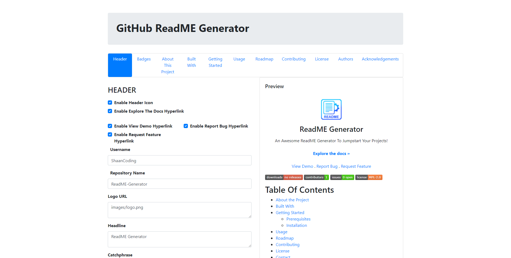

<p align="center">
  <a href="https://github.com/ShaanCoding/ReadME-Generator">
    
  </a>

  <h3 align="center">Finovate</h3>

  <p align="center">
    The Finovate project was developed for Finovate SACCO Kenya. The app helps SACCO users to easily access SACCO services and manage their accounts. It connects to the SACCO API allowing individuals to perform actions like deposit money to their accounts, withdraw, create savings accounts with targets, and access loans from the SACCO. This app also features a second part for savings groups (Chamas) that allow individuals to join the SACCO in groups and own a group account making it easy for them to operate their savings groups in a digital space.
    <br/>
    <br/>
    <a href="https://github.com/ShaanCoding/Finovate"><strong>View Demo »</strong></a>
    <br/>
    <br/>
    <a href="https://github.com/ShaanCoding/Finovate">Explore the docs</a>
    .
    <a href="https://github.com/ShaanCoding/Finovate/issues">Report Bug</a>
    .
    <a href="https://github.com/ShaanCoding/Finovate/issues">Request Feature</a>
  </p>
</p>

    [](https://discord.gg/6Kf422a)

## Table Of Contents

- [Table Of Contents](#table-of-contents)
- [About The Project](#about-the-project)
- [Built With](#built-with)
- [Getting Started](#getting-started)
  - [Prerequisites](#prerequisites)
  - [Installation](#installation)
- [Usage](#usage)
- [Roadmap](#roadmap)
- [Contributing](#contributing)
  - [Creating A Pull Request](#creating-a-pull-request)
- [License](#license)
- [Authors](#authors)
- [Acknowledgements](#acknowledgements)

## About The Project



The Finovate project was developed for Finovate SACCO Kenya. The app helps SACCO users to easily access SACCO services and manage their accounts. It connects to the SACCO API allowing individuals to perform actions like deposit money to their accounts, withdraw, create savings accounts with targets, and access loans from the SACCO. This app also features a second part for savings groups (Chamas) that allow individuals to join the SACCO in groups and own a group account making it easy for them to operate their savings groups in a digital space.

## Built With

The Finovate project is built using the following technologies:

- [React Native](https://reactnative.dev/)
- [JavaScript](https://www.javascript.com/)
- [REST API](https://restfulapi.net/)
- [SQL](https://www.w3schools.com/sql/)

## Getting Started

This is an example of how you may give instructions on setting up your project locally.
To get a local copy up and running follow these simple example steps.

### Prerequisites

This program has no prerequisites.

### Installation

1. Clone the repo

```sh
git clone https://github.com/ShaanCoding/Finovate.git
